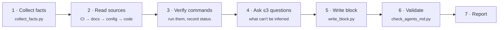

<p align="center">
  
</p>

<p align="center">
  <a href="LICENSE"></a>
  
  
  
  
</p>

<p align="center">
  <b>An agent skill that turns any repository into one an AI coding agent can work in on day one.</b><br>
  It collects facts, <i>runs</i> the real commands, and writes a short, verified <code>AGENTS.md</code>. Nothing in it is guessed.
</p>

---

## Why

Most `AGENTS.md` / `CLAUDE.md` files are either missing or full of things an agent could have found by itself: folder trees, dependency lists, "follow best practices". The useful parts are usually missing:

- the **commands that actually work**, and the ones that silently hang (`npm test` in watch mode, anyone?)
- the **traps**: tests that need a seeded database, scripts that write outside the repo, config defaults pointing at real servers
- the **boundaries and decisions** you can't see in the code

`agentify-repo` documents only that. **Every line has a source**: either the agent ran it and it passed, or the text says where the claim comes from (`from config`, `from code`, `from docs`, `from tests`, `from user`).

## What you get

An `AGENTS.md` like this one, excerpted from a real run on a Spring Boot + PostgreSQL service:

```markdown
## Commands
| Task                     | Command                                      | Status                                   |
|--------------------------|----------------------------------------------|------------------------------------------|
| Load test schema         | `psql … -f db/schema.sql`                     | ✅ verified (in postgres:16-alpine)      |
| Build + all tests (= CI) | `mvn -B verify`                               | ✅ verified (1196 passed, 0 skipped)     |
| Single test              | `mvn -B test -Dtest=AuthControllerTest#…`     | ✅ verified                              |
| E2E sync script          | `bash scripts/verify-sync.sh`                 | ❌ fails (38 OK, 3 failed)               |

## Gotchas & known issues
- Every test TRUNCATEs non-catalog tables; a seeded table your tests need must be
  listed in `DatabaseCleaner.java` or it is wiped before each test (from code).
- `/actuator/health` returns 503 when the SMTP host is unreachable, even with the DB up (verified).
```

Codex reads `AGENTS.md` directly. For Claude compatibility, the skill also creates a `CLAUDE.md` that just imports it (`@AGENTS.md`). Codex-only runs create no Claude file.

## How it works



| Piece | What it does |
|---|---|
| [`SKILL.md`](SKILL.md) | The workflow and hard rules the agent follows |
| [`references/verification.md`](references/verification.md) | How to verify: status vocabulary, missing toolchains, Docker, services, E2E scripts |
| [`references/output-contract.md`](references/output-contract.md) | Section order, useful-vs-noise examples, monorepos |
| [`scripts/collect_facts.py`](scripts/collect_facts.py) | Read-only scan, output as JSON: stacks, CI commands, containers, env var **names**, risky scripts, raw SQL, external hosts in config, installed toolchain, candidate commands |
| [`scripts/write_block.py`](scripts/write_block.py) | Inserts or replaces only the `<!-- agentify:start/end -->` block. Never touches human-written text |
| [`scripts/check_agents_md.py`](scripts/check_agents_md.py) | Validates the result: markers, section order, every command has a status, paths exist, **no leaked secrets**, no filler. With `--brain`, also checks the `docs/agents/` brain |
| [`references/brain.md`](references/brain.md) | Brain mode: structure, domain choice, seeding rules, context-saving rules |
| [`scripts/scaffold_brain.py`](scripts/scaffold_brain.py) | Creates the approved `docs/agents/` skeleton. Never overwrites an existing file. Prints the Context map table for `AGENTS.md` |

All scripts are standard-library Python with no dependencies.

## Brain mode (`--brain`)

A single `AGENTS.md` can only hold so much. Brain mode does a **mini scan** of the repo the first time and leaves a documentation structure that the next agent session can navigate and fill in, loading only what the task needs:

```
AGENTS.md              ← commands + Context map: "if you touch X, read Y"
docs/agents/
  INDEX.md             ← one row per file: file | read when
  architecture.md · glossary.md · MAINTENANCE.md
  domains/<area>.md    ← one per area of the code, with `read_when` + `paths` frontmatter
  decisions/ · runbooks/
```

> *"agentify this repo --brain"* · *"set up a context brain for agents in this repo"*

The agent proposes the structure in chat first and writes only after you approve. Each file is seeded only with sourced facts. Everything else stays as a concrete `<!-- agentify:pending — question -->` for the next session to answer. Existing files are never overwritten. `check_agents_md.py --brain` keeps the brain usable over time:

- every link resolves
- every file is reachable from `INDEX.md`
- every file stays within 80 lines
- frontmatter `paths` still exist, so a file goes stale visibly when its code moves
- no secrets
- pending items are counted as warnings

Commands stay `not verified` in brain mode. Run the normal workflow afterwards to verify them.

## Safety by design

The skill is built to run on repos you care about:

- 🔒 **Never copies secret values.** Only env var names are taken from env files, even when `.env` is committed. Matching values block validation unless an exact non-sensitive coincidence has an explicit, independently supported review. Credential patterns and sensitive key names cannot be exempted.
- 🧪 **Never runs SQL, migrations, or network-touching scripts against anything but a throwaway local container.**
- 🐳 **Asks before installing toolchains** or pulling Docker images. Every container, volume and network it creates is named `agentify-*` and removed afterwards. It checks for name and port collisions with what's already running.
- ✍️ **Never deletes human lines.** Lines that are now wrong get a `<!-- agentify: stale -->` note and are listed in the report.
- 🧹 **Leaves the tree clean.** It reverts lockfile drift and build output, and reports what verification touched.
- 🙅 **Doesn't fix your repo.** Broken things are documented, not silently patched.

## Install

Clone the repo into your agent's skills directory:

```bash
# Claude Code (personal skills)
git clone https://github.com/AdalbertoCV/agentify-repo ~/.claude/skills/agentify-repo

# Cross-agent location used by several tools
git clone https://github.com/AdalbertoCV/agentify-repo ~/.agents/skills/agentify-repo
```

Then, inside any repository, ask your agent:

> *"agentify this repo"* · *"create an AGENTS.md for this project"* · *"audit our AGENTS.md"*

You can also run the collector on its own to see what the agent sees:

```bash
python scripts/collect_facts.py path/to/repo --audit
```

### Codex (Windows / PowerShell)

Requires Git and Python 3.11+. Check `git --version` and `python --version` first.
No Python packages, application dependencies, MCP server, or API key are needed
to install this skill. `py` may be used only if it resolves to a working interpreter.

**Personal installation (all projects):**

```powershell
$skillPath = Join-Path $HOME '.agents/skills/agentify-repo'
if (Test-Path -LiteralPath $skillPath) { throw 'Skill already exists; inspect it before updating.' }
New-Item -ItemType Directory -Force -Path (Split-Path $skillPath) | Out-Null
git clone https://github.com/AdalbertoCV/agentify-repo $skillPath
```

**Project installation (this project only):** run the following from the target
project root instead of performing the personal installation:

```powershell
New-Item -ItemType Directory -Force -Path .agents/skills | Out-Null
git clone https://github.com/AdalbertoCV/agentify-repo .agents/skills/agentify-repo
```

Keep one installation per scope to avoid duplicate skill names. A project-local
clone contains its own Git repository; share its files deliberately if the team
needs them. Installing personally is simpler for individual use.

Codex discovers skills in these locations. If it does not appear, restart Codex.
Open the target project, then invoke:

```text
$agentify-repo Prepare this project for Codex only. Show the verification
results and files changed. Do not create CLAUDE.md.
```

In Codex CLI/IDE, `/skills` also opens the skill selector. This repository does
not register a `/agentify repo` slash command. See the official
[Codex skill documentation](https://learn.chatgpt.com/docs/build-skills).

The skill asks Codex to collect facts, read sources, verify commands, and draft
the Markdown. `write_block.py` writes that draft; it does not infer or generate
the content on its own. `check_agents_md.py` validates the result; it does not
execute the documented commands.

Codex-only validation uses:

```powershell
python "$skillPath/scripts/check_agents_md.py" 'C:/path/to/project' --agent codex
```

`--agent codex` skips only the sibling CLAUDE.md checks. All AGENTS.md structure,
command status, path, and secret checks still run. The default remains
`--agent claude` for compatibility with existing invocations. Existing human
Claude instructions remain input for contradiction review, even in Codex mode.

### Reviewing an env match

The validator reads real env values internally for comparison; it does not print
them or rewrite the document. All matching keys block by default, including
application names. Never change correct framework names or versions to silence
an error. The scanner is an additional safeguard, not proof that a document
contains no secrets.

For a non-sensitive coincidence confirmed independently in a manifest, code, or
human documentation, copy the review ID printed by the validator into a scratch
JSON file. Do not store env values in the file. For example:

```json
{
  "<64-character review ID from the current validation>": {
    "source": "package.json",
    "reason": "The documented public name is independently present in the manifest."
  }
}
```

```powershell
python "$skillPath/scripts/check_agents_md.py" 'C:/path/to/project' --agent codex --env-reviews 'C:/scratch/env-reviews.json'
```

Each review is limited to one document path, line number and content, env file,
key, and matched value. Moving or changing these makes the review stale. Other
occurrences remain blocked. A nonempty reason and a source file inside the repo
are required; the source must contain the matched text (case-insensitive). Env
files and generated agent docs are not independent evidence. The validator checks
these conditions, but the reviewer remains responsible for judging sensitivity.
Credential patterns and sensitive key names cannot be exempted.

Accepted reviews remain visible as warnings. Keep the review file with the run's
report for reproducibility; it contains identifiers, evidence references, and
reasons, not env values. If a match cannot be justified, report it as blocked
instead of altering the documented fact. This workflow is language-independent.

**Preview an unpublished local branch:** the clone commands above download the
published version, which may not contain these changes yet. To test a local
checkout, copy its skill files to a separate project instead of overwriting an
existing personal installation:

```powershell
$source = 'C:/path/to/agentify-repo' # checkout on the local codex-support branch
$preview = 'C:/path/to/preview-project'
$destination = Join-Path $preview '.agents/skills/agentify-repo'
if (Test-Path -LiteralPath $destination) { throw 'Preview skill already exists.' }
New-Item -ItemType Directory -Force -Path $destination | Out-Null
Copy-Item -LiteralPath "$source/SKILL.md" -Destination $destination
foreach ($folder in 'scripts', 'references') {
    Copy-Item -LiteralPath (Join-Path $source $folder) -Destination $destination -Recurse
}
```

Open that preview project in Codex. If the personal skill of the same name is
already installed, explicitly select the project-local skill by its path. This
preview does not change the personal installation or the original application.

### Local QA

From this repository root:

```powershell
python -m unittest discover -s tests -v
git diff --check
```

The dependency-free tests exercise the validator CLI with temporary repos:
Codex warning suppression, unchanged files, legacy Claude behavior, explicit doc
paths, invalid agent values, missing docs, and preserved structure/secret errors.
`tests/test_brain.py` covers brain mode: collector domain candidates, the
scaffolder (no overwrites, all-or-nothing plan validation, dry run) and the
`--brain` checks (Context map, links, orphans, frontmatter, budget, stale paths,
secrets). They do not require Docker, services, or a live coding-agent session.

## Current scope

> [!NOTE]
> **This is an early release.** It is already useful, and we'll keep updating it with broader stack support and more robustness. Here is exactly where it stands, so you know what to expect.

**Tested end to end on real projects** (Windows 11, Claude Code):

| Stack | Project type | Result |
|---|---|---|
| Python | CLI with PyTorch/audio deps, no lockfile, no CI | ✅ install, tests and single test verified; found an interpreter-version trap and an env-gated test file |
| Node / React | Create React App SPA, no CI | ✅ build, tests and dev server verified; found a failing lint, a watch-mode hang and a script that writes outside the repo |
| Java / Maven | Spring Boot + PostgreSQL, CI, two compose files, raw SQL schema | ✅ CI-equivalent `mvn verify` (1196 tests) run in Docker; found a failing E2E script |
| Monorepo | pnpm + Turborepo with a Python package (synthetic) | ✅ per-package `AGENTS.md`, stale human line annotated |

**Detected by the collector, not yet validated on a real project:** Go, Rust, Gradle/Kotlin, PHP, Ruby, Poetry/uv/pnpm/yarn/bun lockfiles, Makefile/justfile/Taskfile.

**Known gaps:**
- .NET (`.csproj` / `.sln`) is not supported yet.
- Large real-world monorepos (Nx, Turborepo with dozens of packages) are untested.
- Merging into an existing, human-written `AGENTS.md`/`CLAUDE.md` has only been tested on a synthetic repo.
- Only tested on Windows with Claude Code. Linux, macOS and other agents should work but are unverified.
- The validator and brain mode have focused CLI regression tests; the collector (beyond `--brain`) and writer still lack a dedicated test suite. The docker-compose reader is a lightweight parser, not a full YAML parser.
- Repos that need private registries or real secrets to build will produce `not verified` rows. That is by design, but untested.

## Roadmap

- [ ] .NET support (`dotnet build/test`, solution layout)
- [ ] Test suite + CI for the scripts, with fixture repos per stack
- [ ] Real-world validation on Go, Rust, Gradle and a large Nx/Turborepo monorepo
- [ ] End-to-end runs on Linux and macOS, and with other agents (Codex, Cursor, opencode)
- [ ] Hardened merge for existing human-written agent docs
- [x] `--brain` mode: a routed `docs/agents/` context brain, scaffolded from a mini scan
- [ ] `--refresh` mode: re-verify an existing `AGENTS.md` and report drift (e.g. on a schedule)

Have a repo where it gets something wrong? [Open an issue](https://github.com/AdalbertoCV/agentify-repo/issues). A short description of the stack and the bad line is the most useful bug report there is.

## Contributing

PRs are welcome, especially:
- **New stack support** in `collect_facts.py`, plus a note in `references/verification.md` on how to verify that stack
- **Failure reports** from real repos, which are what most of the current rules came from
- **Fixture repos** for the upcoming test suite

Please keep the scripts dependency-free (standard library only).

## License

[MIT](LICENSE) © Adal Cerrillo
